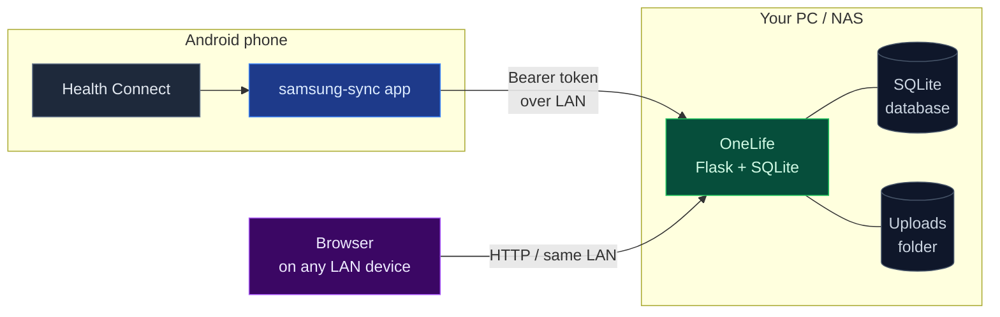

<div align="center">


# OneLife

**Your entire life, in one app, on hardware you own.**

A local-first personal life-management system. Tasks, projects, health
data, journal, contacts, learning, finance, goals, documents — all
under your control, on a machine you control.

[Features](#features) ·
[Quick start](#quick-start) ·
[Android app](#android-companion-app-optional) ·
[Backups](#backups) ·
[Privacy](#privacy-and-security)

<br>

[](LICENSE)
[](https://www.python.org/)
[](lifehub/Dockerfile)
[](https://docs.astral.sh/ruff/)
[](lifehub/tests)
[](lifehub)

</div>

---

## Table of contents

1. [What is OneLife?](#what-is-onelife)
2. [Features](#features)
3. [Architecture](#architecture)
4. [Quick start](#quick-start)
   - [Docker](#docker-linux--nas--windows-with-wsl)
   - [Bare Python](#bare-python-linux--macos)
   - [Bare Windows](#bare-windows-desktop)
5. [Reverse proxy and HTTPS](#reverse-proxy-and-https)
6. [Android companion app (optional)](#android-companion-app-optional)
7. [Backups](#backups)
8. [Updating](#updating)
9. [Development](#development)
10. [Troubleshooting](#troubleshooting)
11. [Privacy and security](#privacy-and-security)
12. [Repository layout](#repository-layout)
13. [License](#license)
14. [Acknowledgements](#acknowledgements)

---

## What is OneLife?

Most "life-management" apps want you to upload your journal, your
finances, your health data, and your habits to their cloud. OneLife
goes the other way: it runs on a single box you own, on a network you
control, and the data never leaves that box. There is no account, no
sync, no telemetry, and no third-party requests of any kind.

The intended deployment is *one person, one PC or NAS, on the LAN*.
The whole product is two repos' worth of code: a Flask web app and an
optional Android companion that pushes your phone's Health Connect data
into it.

> **Not for you if:** you want multi-user, multi-device-across-the-internet,
> SSO, or a hosted offering. OneLife is intentionally none of those. Put
> it behind a reverse proxy and bring your own auth if you need that.

---

## Features

<div align="center">

| Section       | What you get                                                                                       |
|---------------|----------------------------------------------------------------------------------------------------|
| **Tasks**     | Kanban board, priorities, subtasks, tags, recurring tasks, streaks.                                |
| **Health**    | Steps, heart rate, sleep, weight, hydration, workouts, calories — daily heatmap, sparklines.      |
| **Finance**   | Accounts, transactions, budgets, bills, assets, net worth, per-asset valuation history.            |
| **Goals**     | Long-running goals with milestones and progress tracking.                                          |
| **Journal**   | Markdown entries with full-text search.                                                            |
| **Learning**  | Courses, lessons, and spaced-repetition review queue.                                              |
| **Contacts**  | Lightweight address book.                                                                          |
| **Calendar**  | Day / week / month views, events from tasks and finance bills.                                     |
| **Documents** | File uploads (50 MB cap, extension allow-list), full-text search.                                  |
| **Import**    | Full JSON export/import, Samsung Health CSV importer.                                              |
| **Mobile**    | Optional Android app pulls Health Connect data into the server in real time.                       |

</div>

---

## Architecture



- **Backend** — Python 3.11+, Flask 3, SQLAlchemy 2, Flask-Migrate
  (Alembic), marshmallow, flask-limiter, gunicorn.
- **Database** — SQLite by default
  (`lifehub/instance/onelife.db`). PostgreSQL also works — set
  `DATABASE_URL=postgresql+psycopg://…`.
- **Frontend** — server-rendered HTML shell + a single-page app in
  `static/js/app.js`. No build step, no npm, no bundler. Static assets
  total ~100 KB and ship with `Cache-Control: max-age=3600, immutable`.
- **Health ingest** — `POST /api/health/ingest`. Hard-capped at 5 MB
  per request, bearer-token authenticated (constant-time SHA-256
  compare), dedups by `(source, timestamp, value)` before insert.
  Unknown fields in the payload are silently dropped so the app can
  ship new sections without breaking older servers.

---

## Quick start

<div align="center">

| Path                    | Best for                                     | Time to first run |
|-------------------------|----------------------------------------------|-------------------|
| [Docker](#docker-linux--nas--windows-with-wsl)               | Servers, NAS, headless Linux, WSL            | ~3 minutes        |
| [Bare Python](#bare-python-linux--macos)                      | Laptops, dev machines                        | ~5 minutes        |
| [Bare Windows](#bare-windows-desktop)                         | Home desktop with auto-start at logon        | ~5 minutes        |

</div>

### Docker (Linux / NAS / Windows with WSL)

The image is a slim Python 3.12 base, runs as a non-root user, has a
healthcheck, and persists data via bind mounts.

```bash
git clone https://github.com/ThjnToan/OneLife.git
cd OneLife/lifehub
cp .env.example .env             # then edit SECRET_KEY and INGEST_TOKEN
docker compose up -d --build
docker compose logs -f           # tail logs; Ctrl+C to detach
```

The server is on `http://<host>:5000`. SQLite and uploads live in
`lifehub/instance/` and `lifehub/uploads/` on the host.

```bash
docker compose restart            # pick up a new .env
docker compose down               # stop
docker compose pull && docker compose up -d   # after a `git pull`
```

The image's built-in `HEALTHCHECK` hits `/api/healthz` every 30 s. The
compose file's healthcheck hits the heavier `/api/dashboard/summary` —
both work for self-hosting.

### Bare Python (Linux / macOS)

```bash
git clone https://github.com/ThjnToan/OneLife.git
cd OneLife/lifehub
python3.11 -m venv .venv
source .venv/bin/activate
pip install -r requirements.txt

cp .env.example .env
$EDITOR .env                      # at minimum: set SECRET_KEY

flask --app manage db upgrade     # apply migrations

# Production server (gunicorn)
gunicorn --bind 127.0.0.1:5000 --workers 2 --threads 4 wsgi:app

# OR, for development with auto-reload:
FLASK_ENV=development DEBUG=1 python wsgi.py
```

To run as a service that starts on boot, drop a systemd unit at
`/etc/systemd/system/onelife.service`:

```ini
[Unit]
Description=OneLife personal life-management
After=network.target

[Service]
Type=simple
User=onelife
WorkingDirectory=/opt/onelife/lifehub
EnvironmentFile=/opt/onelife/lifehub/.env
ExecStart=/opt/onelife/lifehub/.venv/bin/gunicorn --bind 127.0.0.1:5000 --workers 2 --threads 4 wsgi:app
Restart=on-failure
RestartSec=5

[Install]
WantedBy=multi-user.target
```

```bash
sudo systemctl daemon-reload
sudo systemctl enable --now onelife
sudo journalctl -u onelife -f
```

### Bare Windows (desktop)

A launcher (`start.bat`) starts the server, waits for port 5000, and
opens Chrome in app mode. `manage_startup.bat` can install a
Windows-Startup-folder shortcut that runs the launcher at logon with
no visible console.

```bat
:: First time only:
cd lifehub
python -m venv .venv
.venv\Scripts\pip install -r requirements.txt
copy .env.example .env
notepad .env                      :: set SECRET_KEY at minimum

:: Run the server + open the UI:
start.bat

:: Optional: install auto-start at logon:
manage_startup.bat
```

See [`lifehub/AUTOSTART.txt`](lifehub/AUTOSTART.txt) for the full
description of what the auto-start shortcut does.

---

## Reverse proxy and HTTPS

OneLife ships with no auth, binds to `127.0.0.1` by default, and
assumes a trusted LAN. If you want to expose it beyond that, **put a
reverse proxy in front** and never bind the app directly to a public
interface.

The minimum sensible setup is Caddy or nginx with TLS and a strict
CORS policy. Example Caddyfile:

```caddyfile
onelife.example.com {
    basicauth {
        alice $2a$14$...   # caddy hash-password
    }
    reverse_proxy 127.0.0.1:5000
}
```

When fronted by a proxy:

- Keep `HOST=127.0.0.1` (the default).
- **Do not set `CORS_ORIGINS=*`**. Set it to your real origin:
  `CORS_ORIGINS=https://onelife.example.com`.
- `flask-limiter` defaults to `memory://` (per-process). If you scale
  gunicorn workers or run multiple instances, set
  `RATELIMIT_STORAGE_URL=redis://…` so the limit is shared.

---

## Android companion app (optional)

`samsung-sync/` is a small Android Kotlin app that reads from
[Health Connect](https://play.google.com/store/apps/details?id=com.google.android.apps.healthdata)
and pushes to `/api/health/ingest` on your server over the LAN. It is
**optional** — the web app works fine without it. Install it if you
want real-time health data on top of the daily summaries you enter
manually.

### 1. Generate a token on the server

```bash
cd lifehub
make ingest-token          # prints: INGEST_TOKEN=…
```

Add the printed line to `.env` and restart the server. If
`INGEST_TOKEN` is empty, `/api/health/ingest` returns 503.

### 2. Make the server reachable from the phone

| Setup           | How                                                                | App URL                        |
|-----------------|--------------------------------------------------------------------|--------------------------------|
| LAN (default)   | `HOST=0.0.0.0` in `.env`                                           | `http://192.168.1.10:5000`     |
| USB tether      | `adb reverse tcp:5000 tcp:5000`                                    | `http://localhost:5000`        |
| Android emulator| (emulator hits the host's loopback)                                | `http://10.0.2.2:5000`         |

### 3. Build the APK

- **Android Studio:** open `samsung-sync/`, let Gradle sync, click Run.
- **Command line:**

  ```bash
  cd samsung-sync
  ./gradlew assembleDebug
  # → app/build/outputs/apk/debug/app-debug.apk
  adb install -r app/build/outputs/apk/debug/app-debug.apk
  ```

### 4. Configure on the phone

Open **OneLife Sync** → enter the URL (no trailing slash) → paste the
bearer token → **Save** → **Grant Health Connect access** → **Test
connection** → **Sync now**. Toggle **Background sync** for ongoing
15-minute syncs.

The token is stored in `EncryptedSharedPreferences` (AES-256-GCM, key
held in the Android Keystore). The URL and last-sync time are not
sensitive and live in the regular prefs file.

See [`samsung-sync/README.md`](samsung-sync/README.md) for the full
per-record-type mapping table and troubleshooting.

---

## Backups

The whole app state is two directories:

- `lifehub/instance/` — the SQLite database (`onelife.db`).
- `lifehub/uploads/` — uploaded documents, avatars, etc.

A backup is just a snapshot of both. SQLite is safe to back up live
(`VACUUM INTO` if you want a compacted copy, or just `cp`). The
simplest "good-enough" backup is a daily cron job that tars both
directories:

```bash
# /etc/cron.daily/onelife-backup
tar -czf /backups/onelife-$(date +%F).tgz \
    -C /opt/onelife/lifehub instance uploads
```

Restore is the reverse: stop the server, untar, start the server. The
schema is versioned with Alembic, so the database will self-upgrade on
first start if the code is newer than the backup.

For belt-and-braces, run `GET /api/export` from any browser
occasionally and save the JSON somewhere safe. It is a complete,
versioned dump of every table and re-imports cleanly.

---

## Updating

```bash
# Docker:
cd OneLife/lifehub
git pull
docker compose build && docker compose up -d

# Bare Python:
git pull
source .venv/bin/activate
pip install -r requirements.txt
flask --app manage db upgrade        # applies any pending Alembic migrations
systemctl restart onelife            # or however you supervise the process
```

Database migrations are forward-only and idempotent. Never edit a
migration file after it has been applied to a live database.

---

## Development

```bash
cd lifehub
make install        # pip install -r requirements.txt + dev tools
make test           # 124 tests, ~10 s
make lint           # ruff
make typecheck      # mypy
make run            # dev server with auto-reload
```

The `Makefile` also has `db-migrate msg="..."` to generate a new
Alembic migration after a model change, and `db-history` to inspect
the chain.

Test fixtures live under `tests/fixtures/`. The included
`samsung_sample.zip` is synthetic — never commit a real
`samsunghealth_*.zip` export; the `.gitignore` will refuse it, and
you shouldn't try to bypass that.

---

## Troubleshooting

<details>
<summary><b>RuntimeError: SECRET_KEY must be set in production</b></summary>

You set `FLASK_ENV=production` (or didn't set it, in which case the
default is production) but didn't set `SECRET_KEY`. Either set it in
`.env` or run with `FLASK_ENV=development` for local hacking.
</details>

<details>
<summary><b>/api/health/ingest returns 503 Ingest endpoint disabled</b></summary>

You didn't set `INGEST_TOKEN`. Generate one with `make ingest-token`,
add it to `.env`, and restart.
</details>

<details>
<summary><b>Database is locked</b> (SQLite only)</summary>

Multiple writers at once can hit `database is locked`. Either reduce
concurrency (single gunicorn worker is fine for one user) or switch
to PostgreSQL via `DATABASE_URL=postgresql+psycopg://…`.
</details>

<details>
<summary><b>Port 5000 already in use</b></summary>

On macOS, *AirPlay Receiver* grabs 5000. Either disable it in
System Settings → AirDrop & Handoff, or run with `PORT=5050`.
</details>

<details>
<summary><b>Phone can't reach the server</b></summary>

- Same Wi-Fi network? Guest networks often isolate clients.
- Firewall: `sudo ufw allow 5000/tcp` (Linux), or open the port in
  Windows Defender Firewall.
- Try the URL in the phone's browser first; if it doesn't load, the
  network path is broken before auth matters.
</details>

<details>
<summary><b>Tests fail with IntegrityError on duplicate (source, timestamp, bpm)</b></summary>

That's the dedup constraint working. If a test inserts the same
sample twice by accident, fix the test — don't disable the constraint.
</details>

---

## Privacy and security

- **No telemetry, no analytics, no third-party requests.** The app
  does not load any external scripts, fonts, or beacons. The only
  outbound HTTP requests it ever makes are responses to *your*
  browser.
- **No authentication by design.** This is a single-user LAN app. If
  you need multi-user or internet exposure, put it behind a reverse
  proxy with basic auth or SSO — see [Reverse proxy and
  HTTPS](#reverse-proxy-and-https).
- **Bearer token for the ingest endpoint** is hashed (SHA-256) on
  the server. A config leak reveals the hash, not the token. Rotate
  by generating a new one and restarting.
- **CORS defaults to `*`** for development convenience. Set
  `CORS_ORIGINS=https://your.domain` in production.
- **Security headers** are emitted on every response:
  `X-Content-Type-Options: nosniff`, `X-Frame-Options: DENY`,
  `Referrer-Policy: same-origin`,
  `Cross-Origin-Opener-Policy: same-origin`.
- **Uploads are size-capped** (`MAX_CONTENT_LENGTH_MB`, default 50
  MB) and extension-allow-listed (pdf, png, jpg, gif, doc, docx,
  txt, xls, xlsx, zip, mp3, mp4). The list is in
  [`app/config.py`](lifehub/app/config.py).

---

## Repository layout

```
.
├── lifehub/                     # The web app
│   ├── app/
│   │   ├── routes/              #   Flask blueprints (REST + page)
│   │   ├── schemas/             #   marshmallow input validators
│   │   ├── services/            #   Domain logic (assets, health, etc.)
│   │   ├── __init__.py          #   App factory
│   │   ├── config.py            #   Env-driven config
│   │   ├── extensions.py        #   db, migrate, limiter, cors
│   │   ├── models.py            #   SQLAlchemy models
│   │   └── utils.py             #   utcnow(), try_commit()
│   ├── tests/                   #   pytest (124 tests)
│   ├── migrations/              #   Alembic
│   ├── static/                  #   CSS, JS, manifest, service worker
│   ├── templates/               #   index.html (SPA shell)
│   ├── docs/                    #   INGEST_TOKEN.md
│   ├── Dockerfile
│   ├── docker-compose.yml
│   ├── .env.example
│   ├── Makefile
│   ├── wsgi.py                  #   gunicorn entry
│   ├── manage.py                #   flask CLI entry
│   ├── pyproject.toml           #   ruff, mypy, pytest config
│   ├── requirements.txt
│   └── README.md                #   App-specific docs
│
├── samsung-sync/                # Android companion
│   └── app/src/main/java/com/onelife/sync/
│       ├── Config.kt            #   Encrypted token, regular prefs for URL
│       ├── HealthSync.kt        #   Health Connect client + payload build
│       ├── MainActivity.kt      #   UI + permission flow
│       └── SyncWorker.kt        #   WorkManager periodic sync
│
└── tools/                       # Offline Android SDK / Gradle / JDK
                                  # (gitignored, ~1.5 GB)
```

---

## License

[MIT](LICENSE) — Copyright © 2026 Thien Toan. Do whatever you want,
just keep the copyright notice.

---

## Acknowledgements

OneLife is built on the shoulders of a small, well-chosen set of
open-source libraries:

- [Flask](https://flask.palletsprojects.com/) and
  [Flask-SQLAlchemy](https://flask-sqlalchemy.palletsprojects.com/)
- [marshmallow](https://marshmallow.readthedocs.io/) for input
  validation
- [flask-limiter](https://flask-limiter.readthedocs.io/) for
  rate-limiting
- [Alembic](https://alembic.sqlalchemy.org/) via Flask-Migrate for
  schema migrations
- [Health Connect](https://developer.android.com/health-connect) for
  the Android side
- [ruff](https://docs.astral.sh/ruff/) and
  [mypy](https://mypy.readthedocs.io/) for keeping the codebase
  honest

</div>
